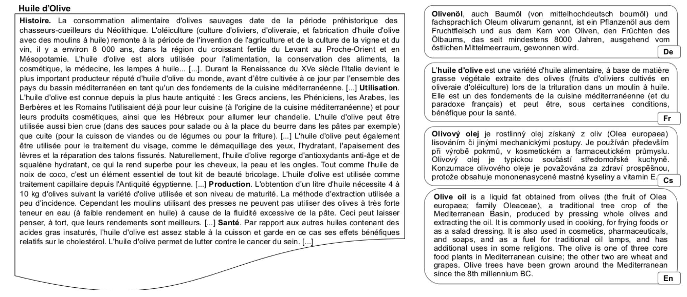

# Papers about Crosslingual Summarization

A collection of papers and materials about cross-lingual text summarization.

# Task Definition

Cross-lingual summarization is a task that aiming at producing the summary in a target language (e.g., English) from a document in a source language (e.g., French). One example given in (Perez-Beltrachini and Lapata, 2021) is shown as followed,

# Survey
* A Survey on Cross-Lingual Summarization (Wang et al., 2022)
  [[Paper]](https://arxiv.org/pdf/2203.12515.pdf)
  
# Datasets

* Models and Datasets for Cross-Lingual Summarisation (Perez-Beltrachini and Lapata, 2021)
  [[Paper]](https://aclanthology.org/2021.emnlp-main.742)
  [[Code]](https://github.com/lauhaide/clads)
  **EMNLP 2021**
* XL-Sum: Large-Scale Multilingual Abstractive Summarization for 44 Languages (Hasan et al., 2021)
  [[Paper]](https://aclanthology.org/2021.findings-acl.413)
  [[Code]](https://github.com/csebuetnlp/xl-sum)
  **ACL 2021 Findings**
  
* A Novel Wikipedia based Dataset for Monolingual and Cross-Lingual Summarization (Fatima and Strube, 2021)
  [[Paper]](https://aclanthology.org/2021.newsum-1.5)
  **3rd Workshop on New Frontiers in Summarization**
  
* MassiveSumm: a very large-scale, very multilingual, news summarisation dataset (Varab and Schluter, 2021)
  [[Paper]](https://aclanthology.org/2021.emnlp-main.797)
  [[Dataset]](https://github.com/danielvarab/massive-summ)
  **EMNLP 2021**
  
* MultiHumES: Multilingual Humanitarian Dataset for Extractive Summarization (Yela-Bello et al., 2021)
  [[Paper]](https://aclanthology.org/2021.eacl-main.146)
  [[Dataset]](https://deephelp.zendesk.com/hc/en-us/sections/360011925552-MultiHumES)
  **EACL 2021**
  
* CrossSum: Beyond English-Centric Cross-Lingual Abstractive Text Summarization for 1500+ Language Pairs (Hasan et al., 2021)
  [[Paper]](https://arxiv.org/abs/2112.08804)
  [[Dataset]](https://github.com/csebuetnlp/CrossSum)
  
* MLSUM: The Multilingual Summarization Corpus (Scialom et al., 2020)
  [[Paper]](https://aclanthology.org/2020.emnlp-main.647)
  [[Dataset]](ttps://github.com/recitalAI/MLSUM)
  **EMNLP 2020**

* WikiLingua: A New Benchmark Dataset for Cross-Lingual Abstractive Summarization (Ladhak et al., 2020)
  [[Paper]](https://aclanthology.org/2020.findings-emnlp.360)
  [[Dataset]](https://github.com/esdurmus/Wikilingua)
  **EMNLP 2020 Findings**
  
* Global Voices: Crossing Borders in Automatic News Summarization (Nguyen and Hal Daumé, 2019)
  [[Paper]](https://aclanthology.org/D19-5411)
  [[Dataset]]()
  **2nd Workshop on New Frontiers in Summarization**
  
* NCLS: Neural Cross-Lingual Summarization (Zhu et al., 2019)
  [[Paper]](https://aclanthology.org/D19-1302)
  [[Dataset]](http://www.nlpr.ia.ac.cn/cip/dataset.htm)
  **EMNLP 2019**

# Methodology

* A Variational Hierarchical Model for Neural Cross-Lingual Summarization (Liang et al., 2022)
  [[Paper]](https://arxiv.org/pdf/2203.03820.pdf)
  [[Code]](https://github.com/XL2248/VHM)
  **ACL 2022**

* Cross-Lingual Abstractive Summarization with Limited Parallel Resources (Bai et al., 2021)
  [[Paper]](https://aclanthology.org/2021.acl-long.538)
  [[Code]](https://github.com/WoodenWhite/MCLAS)
  **ACL 2021**

* Improving Neural Cross-Lingual Summarization via Employing Optimal Transport Distance for Knowledge Distillation (Nguyen and Tuan, 2021)
  [[Paper]](https://arxiv.org/abs/2112.03473v1)
  **AAAI 2022**
  
* Contrastive Aligned Joint Learning for Multilingual Summarization (Wang et al., 2021)
  [[Paper]](https://aclanthology.org/2021.findings-acl.242)
  [[Code]](https://github.com/brxx122/CALMS)
  **ACL 2021 Findings**
  
* A Deep Reinforced Model for Zero-Shot Cross-Lingual Summarization with Bilingual Semantic Similarity Rewards (Dou et al., 2020)
  [[Paper]](https://aclanthology.org/2020.ngt-1.7)
  [[Code]](https://github.com/zdou0830/crosslingual_summarization_semantic)
  **4th Workshop on Neural Generation and Translation**
  
* Jointly Learning to Align and Summarize for Neural Cross-Lingual Summarization (Cao et al., 2020)
  [[Paper]](https://aclanthology.org/2020.acl-main.554)
  **ACL 2020**
  
* Attend, Translate and Summarize: An Efficient Method for Neural Cross-Lingual Summarization (Zhu et al., 2020)
  [[Paper]](https://aclanthology.org/2020.acl-main.121)
  [[Code]](https://github.com/ZNLP/ATSum)
  **ACL 2020**
  
* Mixed-Lingual Pre-training for Cross-lingual Summarization (Xu et al., 2020)
  [[Paper]](https://aclanthology.org/2020.aacl-main.53.pdf)
  [[Code]]()
  **AACL 2020**
  
* A Robust Abstractive System for Cross-Lingual Summarization (Ouyang et al., 2019)
  [[Paper]](https://aclanthology.org/N19-1204)
  **NAACL 2019**

# Evaluation
* Evaluating the Efficacy of Summarization Evaluation across Languages (Koto et al., 2021)
  [[Paper]](https://aclanthology.org/2021.findings-acl.71)
  **ACL 2021 Findings**

